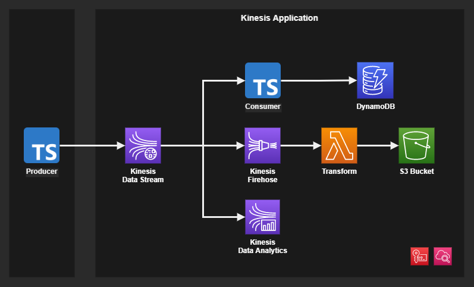

# AWS Kinesis

AWS Kinesis services architecture.



## Running

Create the infrastructure:

```sh
terraform init
terraform apply -auto-approve
```

Install the dependencies:

```sh
yarn install
```

Run the tasks:

```sh
yarn run get
yarn run put
yarn run sub
```

Check `package.json` for more commands.

### Kinesis Client Library (KCL)

An example of KCL is also available.

```sh
mvn install
mvn compile
```

Run the Java program:

```sh
mvn exec:java -pl consumer
mvn exec:java -pl producer
```

### Firehose PUT


