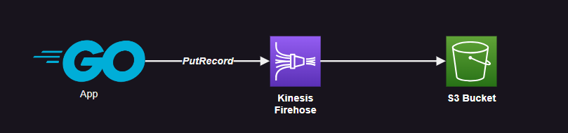

# AWS Kinesis

AWS Kinesis services architecture. The main project will work with most of the components in an fully-integrated scenario.


Additionally, a small Go client will send data directly to a Firehose `PutRecord` endpoint:



## Running

Create the infrastructure:

```sh
terraform init
terraform apply -auto-approve
```

Install the dependencies:

```sh
yarn install
```

Run the tasks:

```sh
yarn run get
yarn run put
yarn run sub
```

Check `package.json` for more commands.

### Kinesis Client Library (KCL)

An example of KCL is also available.

```sh
mvn install
mvn compile
```

Run the Java program:

```sh
mvn exec:java -pl consumer
mvn exec:java -pl producer
```

### Firehose direct `PutRecord`

Run the `go-put` app to send data directly to Firehose.

Create the `.env` file:

```sh
DELIVERY_STREAM_NAME="PUT-S3-XYZ"
```

Run the application to send sample data directly to the `PutRecord` action:

```
go get
go run .
```
